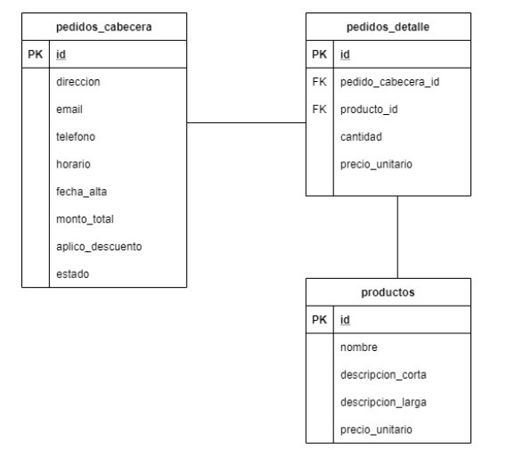

## Introducción 
La tarea consiste en implementar un set de endpoints de una API Rest mediante Spring Boot.

Nuestras expectativas son:
- Valoramos una solución simple y limpia.
- La solución debe funcionar en forma productiva. 
- Se deben implementar los test correspondientes para validar su funcionamiento.
- El ejercicio debe ser resuelto dentro del transcurso de 3 días.

## Instrucciones
Para realizar eficientemente esta tarea le recomendamos seguir los siguientes pasos:

1. Usar una cuenta personal en [Github](https://github.com)
2. Hacer clic en el botón "Use this template" para crear un repositorio en base a esta plantilla
3. Leer atentamente el enunciado y realizar el ejercicio.
4. Validar los test con el comando ```mvn test```
5. Actualizar el repositorio. 
6. Enviar la URL del repositorio por correo electrónico. 
 
## Requisitos
- JDK 8 o superior
- Maven

## Enunciado
Se solicita implementar una API Rest que permita registrar el alta de pedidos de una pizzería.

Se deben modelar las siguientes Entidades:
- Productos
- Pedidos (Cabecera y Detalle)



Se deben implementar los siguientes endpoints:

- CRUD de Productos
- Alta de Pedido
- Listar pedidos por fecha 

Se debe implementar la siguiente regla de negocio:

- Si el cliente solicita más de 3 artículos, se le aplica un 30% de descuento.

Las respuestas deben ser en formato JSON.

## Ejemplos

### Crear un pedido 
* Method: POST
* Path: /pedidos
* Request 
```json
  {
    "direccion": "Dorton Road 80",
    "email": "tsayb@opera.com", 
    "telefono": "(0351) 48158101",
    "horario": "21:00",
    "detalle": [
     { "producto": "89efb206-2aa6-4e21-8a23-5765e3de1f31", 
       "cantidad": 1 },
     { "producto": "e29ebd0c-39d2-4054-b0f4-ed2d0ea089a1", 
       "cantidad": 1 }]
   }
```
* Response 201
```json
  {
    "fecha": "2020-05-24",
    "direccion": "Dorton Road 80",
    "email": "tsayb@opera.com", 
    "telefono": "(0351) 48158101",
    "horario": "21:00",
    "detalle": [
     { "producto": "89efb206-2aa6-4e21-8a23-5765e3de1f31",
       "nombre": "Jamón y morrones", 
       "cantidad": 1 , 
       "importe" : 550.00 },
     { "producto": "e29ebd0c-39d2-4054-b0f4-ed2d0ea089a1",
       "nombre": "Palmitos", 
       "cantidad": 1 ,
       "importe" : 600.00 }] ,
     "total": 1150.00,
     "descuento": false,
     "estado": "PENDIENTE"
   }
```
### Crear un pedido con descuento 
* Method: POST
* Path: /pedidos
* Request 
```json
  {
    "direccion": "Dorton Road 80",
    "email": "tsayb@opera.com", 
    "telefono": "(0351) 48158101",
    "horario": "21:00",
    "detalle": [
     { "producto": "89efb206-2aa6-4e21-8a23-5765e3de1f31", 
       "cantidad": 2 },
     { "producto": "e29ebd0c-39d2-4054-b0f4-ed2d0ea089a1", 
       "cantidad": 2 }]
   }
```
* Response 201
```json
  {
    "fecha": "2020-05-24",
    "direccion": "Dorton Road 80",
    "email": "tsayb@opera.com", 
    "telefono": "(0351) 48158101",
    "horario": "21:00",
    "detalle": [
     { "producto": "89efb206-2aa6-4e21-8a23-5765e3de1f31",
       "nombre": "Jamón y morrones", 
       "cantidad": 2 , 
       "importe" : 1100.00 },
     { "producto": "e29ebd0c-39d2-4054-b0f4-ed2d0ea089a1",
       "nombre": "Palmitos", 
       "cantidad": 2 ,
       "importe" : 1200.00 }] ,
     "total": 1610.00, 
     "descuento": true,
     "estado": "PENDIENTE"
   }
```
### Realizar un pedido con errores 
* Method: POST
* Path: /pedidos
* Request 
```json
  {
    "email": "tsayb@opera.com", 
    "telefono": "(0351) 48158101",
    "horario": "21:00",
    "detalle": [
     { "producto": "89efb206-2aa6-4e21-8a23-5765e3de1f31" },
     { "producto": "e29ebd0c-39d2-4054-b0f4-ed2d0ea089a1", 
       "cantidad": 2 }]
   }
```
* Response 400
```json
{
   "errores": [{
      "error": "la direccion no puede estar nula"
    }, {
      "error": "falta ingresar cantidad"
    }]
}
```
### Listar pedidos por fecha 
* Method: GET
* Path: /pedidos?fecha=2020-05-26
* Response 200
```json
  [
   {
    "fecha": "2020-05-26",
    "direccion": "Dorton Road 80",
    "email": "tsayb@opera.com", 
    "telefono": "(0351) 48158101",
    "horario": "21:00",
    "detalle": [
     { "producto": "89efb206-2aa6-4e21-8a23-5765e3de1f31",
       "nombre": "Jamón y morrones", 
       "cantidad": 2 , 
       "importe" : 1100.00 },
     { "producto": "e29ebd0c-39d2-4054-b0f4-ed2d0ea089a1",
       "nombre": "Palmitos", 
       "cantidad": 2 ,
       "importe" : 1200.00 }] ,
     "total": 1610.00, 
     "descuento": true
   },
   {
    "fecha": "2020-05-26",
    "direccion": "Artisan Hill 47",
    "email": "ghathawayg@home.pl", 
    "telefono": "(0358) 48997013",
    "horario": "22:30",
    "detalle": [
     { "producto": "89efb206-2aa6-4e21-8a23-5765e3de1f31",
       "nombre": "Jamón y morrones", 
       "cantidad": 1 , 
       "importe" : 550.00 }] ,
     "total": 550.00, 
     "descuento": false
   }]
```
### Crear un producto 
* Method: POST
* Path: /productos
* Request 
```json
   {
    "id": "89efb206-2aa6-4e21-8a23-5765e3de1f31",
    "nombre": "Jamón y morrones",
    "descripcionCorta" : "Pizza de jamón y morrones",
    "descripcionLarga" : "Mozzarella, jamón, morrones y aceitunas verdes",
    "precioUnitario" : 550.00 
   }
```
* Response 201
### Modificar un producto 
* Method: PUT
* Path: /productos/89efb206-2aa6-4e21-8a23-5765e3de1f31
* Request 
```json
   {
    "nombre": "Jamón y morrones",
    "descripcionCorta" : "Pizza de jamón y morrones",
    "descripcionLarga" : "Mozzarella, jamón, morrones y aceitunas verdes",
    "precioUnitario" : 500.00 
   }
```
* Response 204
### Consultar un producto 
* Method: GET
* Path: /productos/89efb206-2aa6-4e21-8a23-5765e3de1f31
* Response 200
```json
   {
    "id": "89efb206-2aa6-4e21-8a23-5765e3de1f31",
    "nombre": "Jamón y morrones",
    "descripcionCorta" : "Pizza de jamón y morrones",
    "descripcionLarga" : "Mozzarella, jamón, morrones y aceitunas verdes",
    "precioUnitario" : 500.00 
   }
```
### Consultar un producto que no existe 
* Method: GET
* Path: /productos/89efb206-2aa6-4e21-8a23-5765e3de1f30
* Response 404 
```json
   {
    "error": "Producto no encontrado" 
   }
```
### Borrar un producto 
* Method: DELETE
* Path: /productos/89efb206-2aa6-4e21-8a23-5765e3de1f31
* Response 204 
